# Pokémon Metallic Sunrise

This is a modified version of [Pokémon Polished Crystal](https://github.com/Rangi42/polishedcrystal), originally based on [the Pokémon Crystal disassembly](https://github.com/pret/pokecrystal).

Metallic Sunrise is designed as a "booster pack" of content, adding a handful of new species while making several changes to existing moves, type combinations, and base stats. The majority of the underlying content is still the Polished team's design, and I have zero intentions of trying to supercede or overshadow their fantastic work - I highly encourage giving the hack a look, and supporting them however you can. Key features of Metallic Sunrise include:
* 13 added species of Pokémon - five from other regions, five new evolutionary members, and one all-new evolutionary line with three stages.
* Tweaks to many underwhelming moves, such as String Shot, Horn Attack, and Flash, to make them more compelling options through the early and mid-game.
* 5 additional TMs distributed throughout the game.
* Added sources for sought-after items such as Gold and Silver Leaves, Ability Pills, and Mint Leaves.
* Ice Stones may be obtained by trading points with Buena, allowing certain species to evolve much earlier than Ice Path.

All information below this line is currently copied verbatim from the Polished Crystal readme, and will be later edited when I approach an initial release. Thanks for your patience!

## Download and Play

The current beta version is **3.0.0**. It has some incomplete original content and known bugs, but it's playable from start to finish. Download the [nightly release](https://github.com/Rangi42/polishedcrystal/releases/tag/v3.0.0-beta) to get the very latest ROM, up-to-date with the `master` code branch.

The most recent official version is [2.2.0](https://github.com/Rangi42/polishedcrystal/releases/tag/v2.2.0) as of September 20, 2016. [The changelog](CHANGELOG.md) lists all changes since then. I recommend playing the 3.0.0 beta instead.

*If you have any questions about these steps, [read the FAQ](FAQ.md)!*

## Features

A full list of features is in [FEATURES.md](FEATURES.md). Features new to the beta are in [CHANGELOG.md](CHANGELOG.md). Some highlights:

* 253 Pokémon, including some new evolutions.
* 48 new moves.
* 65 TMs and 21 move tutors.
* Many new mechanics, including the Fairy type, Physical/Special split, Natures, unlimited TMs, Running Shoes, and continuous Repel.
* New maps: some restored from R/B/Y, some devamped from HG/SS, and some original.
* New characters, including Lorelei and Agatha from R/B/Y, Lyra and the Team Rocket Executives from HG/SS, and others.
* More post-game content, like Gym Leader rematches and an event after the battle with Red.
* An improved level curve with steadily increasing challenges throughout the game.
* Music and graphics devamped from other versions.

## Discussion

You can post questions or comments on any of these sites. But please read the [FAQ](FAQ.md) first if you have a question.

* [Discord](https://discord.gg/ZK5pqK8)
* [Skeetendo](https://hax.iimarckus.org/topic/6874/)
* [PokéCommunity](http://www.pokecommunity.com/showthread.php?t=373172)
* [Romhack.me](http://www.romhack.me/polishedcrystal/wall/)
* [/r/PokemonROMHacks](https://www.reddit.com/r/PokemonROMhacks/comments/51kbcn/pok%C3%A9mon_polished_crystal_200/)
* [Nuzlocke Forums](http://s7.zetaboards.com/Nuzlocke_Forum/topic/11003710/)
* [Pokémon Hackers Online](http://www.pokemonhackersonline.com/showthread.php?t=15811)

## Screenshots

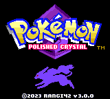
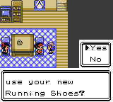
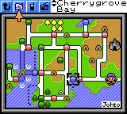
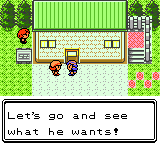
  
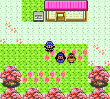
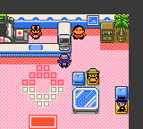
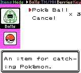
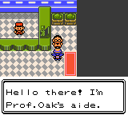
  
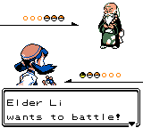
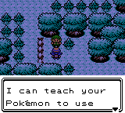
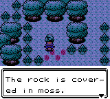
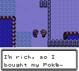
  
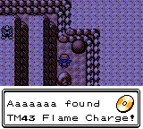
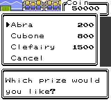
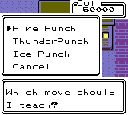
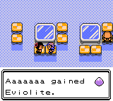
  
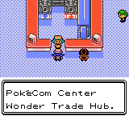
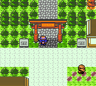
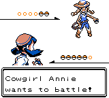
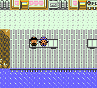
  
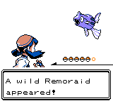

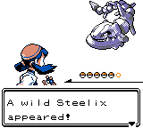
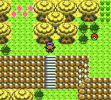
  
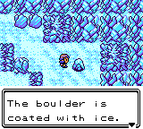
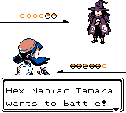
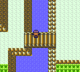
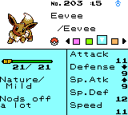

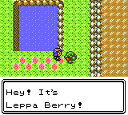
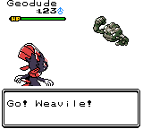
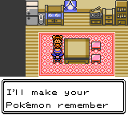
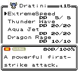
  
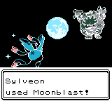

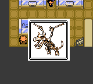
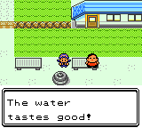
  
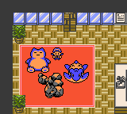
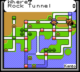
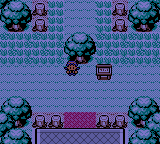
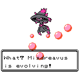
  

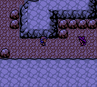
  
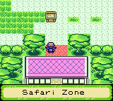
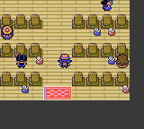
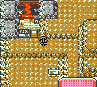
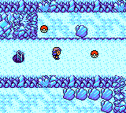
